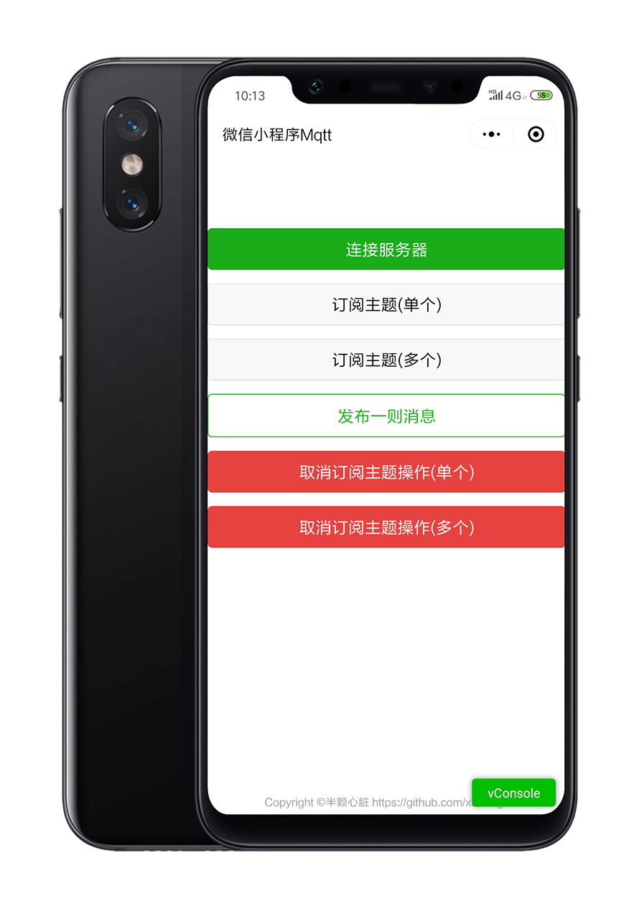
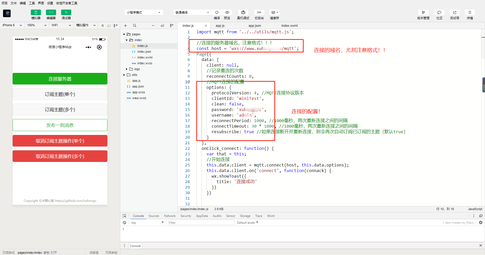

<p align="center">
  
</p>
 

## 一、前言

  - 这是一个开源的可连接**非微信服务器**的```mqtt.js```的代码工程，本工程的配置文件如下图所示```index.js```，在里面修改为您的搭建好的MQTT服务器以及想要订阅的主题，想要连接更多关于微信小程序控制智能硬件（包括```esp8266、esp32```），包括，请移步：
  
   - 自搭mqtt服务器：https://blog.csdn.net/xh870189248/article/details/84070944
  
   - 连接阿里云物联网平台：https://xuhong.blog.csdn.net/article/details/91490697
  

  
## 二、版本迭代
|版本|更新说明|更新时间|
| :---- | :---- | :----- | 
|1|首次提交|2018-11-18|
|2| phao mqtt底层库移除，更换为 mqtt.js!修复稳定性问题！|2019-2-20|
|3| 新增支持连接三元组阿里云物联网平台Mqtt服务器|2019-6-12|
## 三、特别注意

  - 还是要特别提醒，不管是连接的哪个```mqtt```服务器，都要默认的是```443```端口！连接格式：```wsx:www.domain.com/mqtt```，不用带端口号！
  - 移植来自 https://github.com/mqttjs/MQTT.js 更多使用技巧访问其使用文档！或者阅读我本仓库提供的代码！共勉！
 
## 四、加群将免费提供服务器连接测试！
 
   - 福利多多，请加QQ群：434878850
 ---------------------------
 
 

## 五、本人开源 微信物联网控制 一览表

|开源项目|地址|开源时间|
|----|----|----|
|微信小程序连接mqtt服务器，控制esp8266智能硬件|https://github.com/xuhongv/WeChatMiniEsp8266|2018.11|
|微信公众号airkiss配网以及近场发现在esp8266 rtos3.1 的实现|https://github.com/xuhongv/xLibEsp8266Rtos3.1AirKiss|2019.3|
|微信公众号airkiss配网以及近场发现在esp32 esp-idf 的实现|https://github.com/xuhongv/xLibEsp32IdfAirKiss|2019.9|
|微信小程序控制esp8266实现七彩效果项目源码| https://github.com/xuhongv/WCMiniColorSetForEsp8266|2019.9|
|微信小程序蓝牙配网blufi实现在esp32源码| https://github.com/xuhongv/BlufiEsp32WeChat|2019.11|
|微信小程序蓝牙ble控制esp32七彩灯效果| https://blog.csdn.net/xh870189248/article/details/101849759|2019.10|
|可商用的事件分发的微信小程序mqtt断线重连框架|https://blog.csdn.net/xh870189248/article/details/88718302|2019.2|
|微信小程序以 websocket 连接阿里云IOT物联网平台mqtt服务器|https://blog.csdn.net/xh870189248/article/details/91490697|2019.6|
|微信公众号网页实现连接mqtt服务器|https://blog.csdn.net/xh870189248/article/details/100738444|2019.9|


## 六、讨论交流


<table>
  <tbody>
    <tr >
      <td align="center" valign="middle" style="border-style:none">
       
        <p style="font-size:12px;">QQ群号：434878850</p>
      </td>
      <td align="center" valign="middle" style="border-style:none">
        
        <p style="font-size:12px;">微信公众号：徐宏blog</p>
      </td>
    </tr>
  </tbody>
</table>

